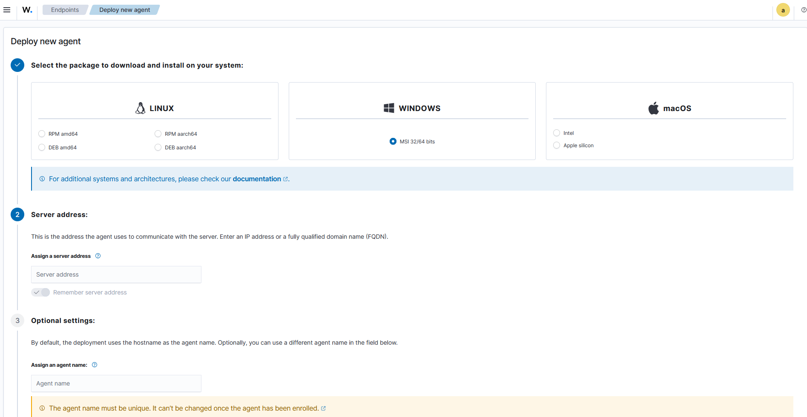
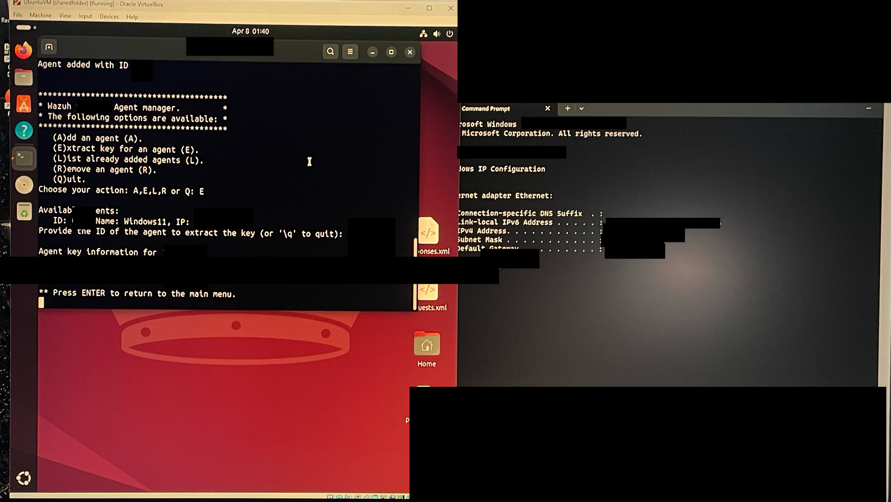
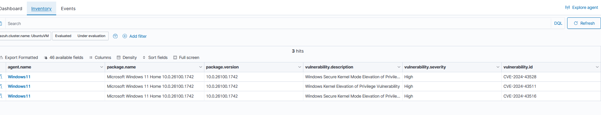
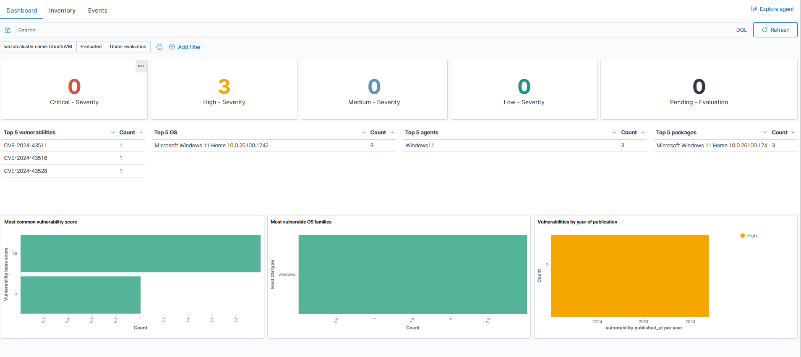
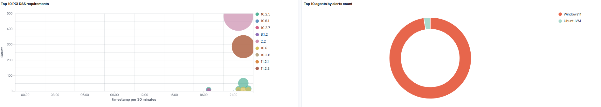
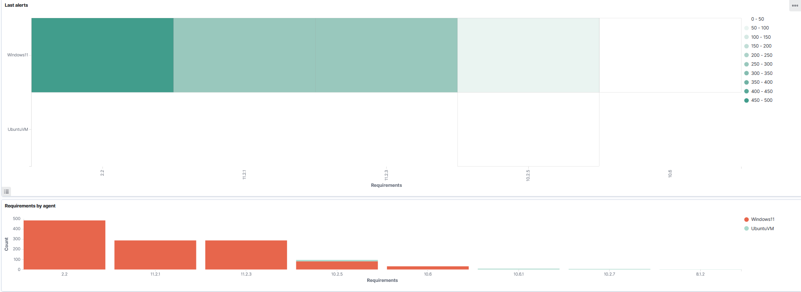

# wazuh-alienvault-otx-kibana-monitoring-lab
Hands-on Wazuh SIEM lab with Windows &amp; Linux agents, AlienVault OTX threat intelligence, and Kibana dashboards for alerting, compliance, and vulnerability monitoring.

## Wazuh + Elastic Stack Security Monitoring
Hands-on security monitoring lab using Wazuh, Elastic Stack, and multiple virtual machines to collect logs, detect threats, perform compliance check, and analyze alerts mapped to the MITRE ATT&CK framework.

## Project Overview
In this lab, I deployed a full Wazuh Manager + Elastic Stack SIEM environment and installed agents on both Windows and Linux systems. I monitored system activity, analyzed high-severity alerts, reviewed MITRE ATT&CK-mapped detections, and evaluated host security compliance.

This project demonstrates practical experience with:
- Endpoint security monitoring
- Log ingestion and event correlation
- Threat detection
- Host vulnerability detection
- Compliance auditing
- Wazuh agent enrollment & management

## Lab Architecture
- Wazuh Manager running Ubuntu VM
- Windows 11 VM with Wazuh Agent
- Ubuntu VM with Wazuh Agent
- Elastic Stack for dashboards, visualization, and alerting
- Networked via VirtualBox host-only and NAT adapters

## Key Activities Completed

## **1. Installed & configured Wazuh Manager**
- Set up Wazuh server on Ubuntu
- Configured agent enrollment
- Enabled vulnerability detection, FIM, MITRE ATT&CK, and configuration assessment

## **2. Installed Wazuh Agents**
- Installed Windows MSI agent
- Installed Linux DEB agent
- Generated and applied enrollment keys
- Verified agent connectivity

## **3. Security & Threat Monitoring**
- Collected system, authentication, and event logs
- Monitored failed logins and privilege escalation attempts
- Reviewed MITRE ATT&CK-mapped detections
- Identified anomalies across agents

## **4. Vulnerability Detection**
- Wazuh discovered multiple Windows vulnerabilities
- Reviewed CVEs, descriptions, and affected packages

## **5. Compliance Benchmarking**
- Ran CIS Microsoft Windows 11 Benchmark v3.0.0
- Reviewed failed and passed configuration checks
- Analyzed compliance gaps

## **6. PCI-DSS & Other Framework Monitoring**
- Monitored PCI-DSS rule coverage
- Visualized high-volume rules and alerts
- Compared agent compliance

## Screenshots

## **1. Agent Enrollment & Key Extraction**

The Wazuh Manager terminal on ubuntu shows the agent enrollment workflow. The Windows 11 agent was added, assigned an ID, and its unique enrollment key was extracted for secure authentication. This key is later used to pair the endpoint agent with the Wazuh Manager.

## **2. Deploying a New Agent**
A guided deployment workflow used to install and enroll a new Windows endpoint agent. The Windows MSI package was selected, the Wazuh Manager IP was entered, and an optional agent name was configured. After installation, the agent securely connected to the manager and completed enrollment.

## **3. MITRE ATT&CK Dashboard Analysis**
A visualization of security detections mapped to the MITRE ATT&CK framework for both Windows and Linux agents. The dashboard highlights technique and tactic distribution, including privilege escalation, persistence, account creation, service modifications, and domain policy changes. It also shows alert spikes over time and detection frequency comparisons across agents.

## **4. MITRE ATT&CK Technique & Tactic Analysis**
I reviewed MITRE ATT&CK-mapped detections to understand which tactics and techniques were triggered across both agents. 
The visualization highlights total alerts, technique frequency, authentication successes, and tactic categories such as privilege escalation, persistence, and defense evasion. The chat also compares MITRE-related detections between the Windows and Ubuntu endpoints, helping identify which system generated the most high-risk activity.

## **5. Agent Key Extraction & Inventory Verification**
Using the Wazuh Manager CLI, I extracted the enrollment key associated with that agent. This key is required to securely pair the endpoint (Windows 11 VM) with the Wazuh Manager. The terminal confirms the agent addition, available actions, and the extracted key.

The Windows 11 agent appears in the list with OS details, package versions, and detected vulnerabilities. This confirms the agent successfully connected, enrolled, and began reporting system data. This includes high-severity Windows kernel and driver vulnerabilities.

## **6. Vulnerability Dashboard Overview**
This displays the vulnerability summary for the enrolled Windows 11 agent. It shows the total number of detected vulnerabilities categorized by critical, high, medium, low, and pending evaluation. The dashboard includes top vulnerabilities by severity, affected packages, and agent distribution. This confirms Wazuh's ability to identify OS-level weaknesses such as kernel, driver, and privilege-related CVEs.

## **7. Wazuh Overview Panel**
This section highlights the high-level environment overview, including agent health, recent alert counts, endpoint security modules, and integrations such as MITRE ATT&CK, PCI-DSS, HIPPA, NIST 800-53, and cloud service monitoring. It demonstrates the centralized threat detection and compliance monitoring across the environment that Wazuh provides.

## **8. PCI-DSS Requirement Monitoring**
PCI-DSS-mapped compliance checks for both Windows and Linux agents. The bubble chart highlights the highest-volume PCI-DSS requirements being evaluated, while the donut chart breaks down which agents generated PCI-aligned findings. The CIS Benchmark panel below displays specific failed configuration controls that overlap with PCI-DSS expectations such as password length, lockout thresholds, and system hardening policies.

## **9. Requirements by Agent**
Comparison of evaluated compliance requirements across Windows 11 and Ubuntu. The heat map visualizes the requirement density per agent, and the bar chart shows the number of evaluated controls mapped to each policy category. Helps identified which host contributes the most compliance gaps and where remediation should be prioritized.

## **10. Threat Hunting Dashboard**
Threat-hunting view showing total alert volume, MITRE ATT&CK detections, authentication successes and failures, and spikes in event activity. Includes agent-specified alert distribution and high-frequency detection patterns used to identify suspicious behavior such as credential misuse, privilege escalation attempts, and abnormal activity across endpoints.

## Tools & Technologies
- Wazuh SIEM
- Elastic Stack (Kibana)
- Windows & Linux Endpoint Agents
- AlienVault OTX Threat Intelligence
- File and Integrity Monitoring
- Vulnerability Detection Module
- MITRE ATT&CK Mappings
- PCI-DSS / HIPPA / NIST 800-53 Compliance Auditing
- VirtualBox Networking (Host-Only + NAT)

## Purpose 
This lab project was created to gain hands-on experience with security monitoring, endpoint visibility, threat detection workflows, and SIEM-style data analysis using Wazuh and Elastic Stack.
It replicates real security operations tasks including:
- Agent deployment & enrollment
- Log ingestion and analysis
- MITRE ATT&CK threat correlation
- Vulnerability detection
- Compliance benchmarking
- Alert investigation & threat-hunting
